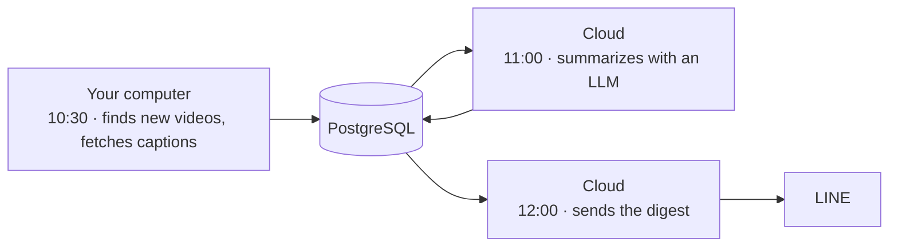

# YouTube Learning Assistant

[](https://github.com/show20130831/YouTube-Learning-Assistant/actions/workflows/ci.yml)

A daily study digest of the YouTube channels you follow, summarized by AI and delivered to LINE.

## What it does

- **Follows your channels.** Every day it checks the channels you choose for new videos and skips Shorts.
- **Summarizes what's new.** Each video becomes a one-line summary, key points and keywords in Traditional Chinese, with technical terms kept in English.
- **Shows how far to trust each summary.** Ratings from ⭐ to ⭐⭐⭐ reflect the source: manual captions, auto-generated captions, or only the title and description. Videos without enough text get no summary rather than a made-up one.
- **Puts your interests first.** Videos are ranked by the topics you care about, with a 7-day view of trending topics.
- **Arrives at noon on LINE.** One message a day, with a short note if anything needs your attention. Everything runs on free tiers.

## Sample digest

Output of `uv run yla demo`, which uses sample data.

```text
📺 今日 YouTube 學習摘要｜2026/10/07

今日追蹤頻道：1 個
發現新影片：4 部（另略過 Shorts 1 部）
完成分析：3 部

🎥 影片 1

標題：
Evaluating RAG Pipelines in Practice｜Example AI Lab

摘要依據：YouTube 自動字幕
摘要信心：⭐⭐
🎯 相關主題：RAG、LLM

一句話摘要：
影片介紹評估檢索增強生成（Retrieval-Augmented Generation）流程的三個步驟：檢索召回率、答案忠實度與持續追蹤。

重點：
- 先用小型標註資料集計算檢索的召回率（Recall@k）。
- 再檢查答案中的每個主張是否都有檢索段落支持，也就是忠實度（Faithfulness）。
- 每次調整切段方式（Chunking）或嵌入模型（Embedding Model）時都要重新追蹤指標。
```

## How it works



Captions are collected on your own computer because YouTube restricts caption access from cloud servers. Summarizing and delivery run in the cloud, so the digest still arrives, with a heads-up, on days your computer is off.

## Try it

See a full digest generated from sample data. No accounts or setup needed beyond [uv](https://docs.astral.sh/uv/).

```bash
git clone https://github.com/show20130831/YouTube-Learning-Assistant.git
cd YouTube-Learning-Assistant
uv sync
uv run yla demo --explain
```

## Self-hosting

You need free accounts on [Neon](https://neon.tech) (PostgreSQL), [OpenRouter](https://openrouter.ai), [LINE Messaging API](https://developers.line.biz) and [Modal](https://modal.com). A [YouTube Data API](https://developers.google.com/youtube/v3) key is optional and enables skipping Shorts.

1. **Configure.** Copy `config/settings.example.yaml` to `config/settings.yaml` and list your channels and topics. Copy `.env.example` to `.env` and add your keys.
2. **Set up the database.**
   ```bash
   uv run alembic upgrade head
   uv run yla sync-config
   ```
3. **Deploy the cloud jobs.**
   ```bash
   uv run modal secret create yla-secrets --from-dotenv .env
   uv run modal deploy src/yla/modal_app.py
   ```
4. **Schedule your computer.** On Windows:
   ```powershell
   powershell -ExecutionPolicy Bypass -File scripts\windows\register-task.ps1
   ```
   On macOS or Linux, run `uv run yla worker` daily at 10:30 with cron or launchd.
5. **Check on it.** `uv run yla status` shows recent runs.

## Built with

Python · PostgreSQL · SQLAlchemy · Modal · OpenRouter · LINE Messaging API · YouTube RSS and Data API

## License

[MIT](LICENSE)
